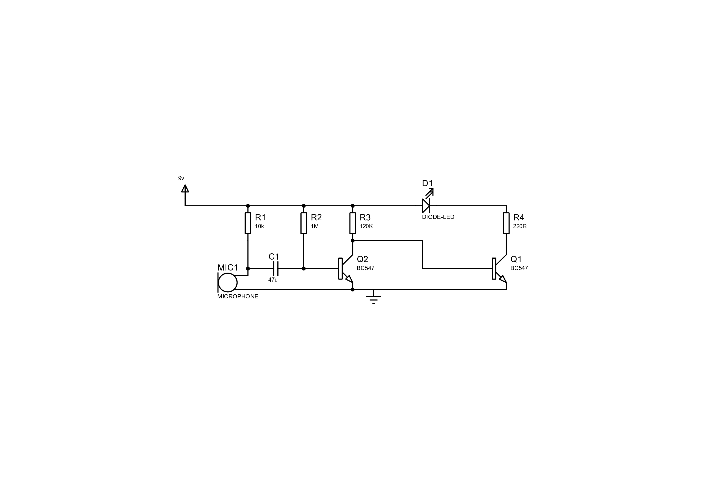

# Noise Level Indicator (Evolved from Clap Switch)

## Project Overview
The **Noise Level Indicator** project began as a simple clap switch and evolved into a system capable of detecting noise levels and visually representing them through an LED. This project utilizes basic electronic components to create a functional noise indicator that responds to varying sound intensities in the environment.

## How It Works
When the condenser microphone detects sound, it generates an electrical signal. This signal is amplified by two **BC547 transistors** and processed through a series of resistors and capacitors. The LED glows for a duration that is directly proportional to the intensity of the noise detected, providing a visual representation of noise levels.

## Key Features
- **Real-time noise detection and response**  
- **Simple and cost-effective design**  
- **Visual representation of sound intensity**  
- **Educational and practical for learning about sound-based feedback systems**  

## Components Required
- **Resistors**: 10k, 220, 120k, 1M ohms  
- **Capacitors**: 47µF, 100nF (x2)  
- **Electric condenser microphone**  
- **BC547 transistors** (x2)  
- **LED**  
- **9V battery**  
- **Digital multimeter**  
- **Wires**  

## Circuit Diagram

## Working Principle
1. **Sound Detection**: The condenser microphone detects sound and generates a corresponding electrical signal.
2. **Signal Amplification**: The signal is amplified by two BC547 transistors.
3. **Processing**: Resistors and capacitors filter and condition the amplified signal.
4. **Visual Feedback**: The LED glows for a duration proportional to the intensity of the detected sound.

## Observation Table
| Sound Frequency | Observation (LED Duration) |
|-----------------|----------------------------|
| Low (1 kHz)     | Short                      |
| Medium (2 kHz)  | Medium                     |
| High (5 kHz)    | Long                       |

## Conclusion
The project effectively detects varying noise levels and adjusts the LED glow duration accordingly. It demonstrates the practical application of sound-based feedback systems, evolving from a basic clap switch to a more versatile noise level indicator.

---
### How to Use
1. Assemble the circuit as per the diagram.
2. Power the system using a 9V battery.
3. Observe the LED response to different noise levels.

---
### Future Enhancements
- Add more LEDs to represent different noise levels.
- Implement a digital display to show noise levels numerically.
- Use a microcontroller for more accurate sound analysis.

---
### Authors
- **Parth Doshi**  
- **Jeel Bakrania**  
- **Diya Mahajan**  

**MIT-WORLD PEACE UNIVERSITY**  

Feel free to contribute or provide feedback for improvements!

